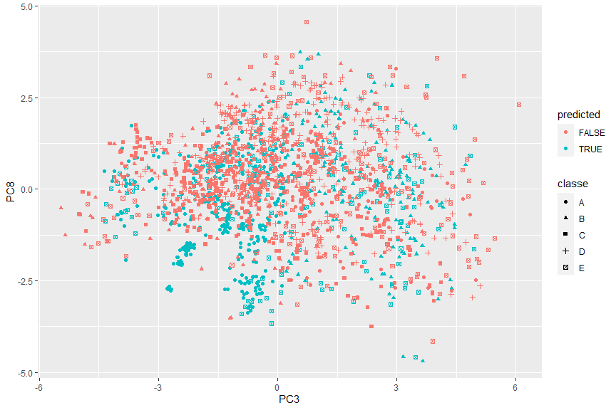
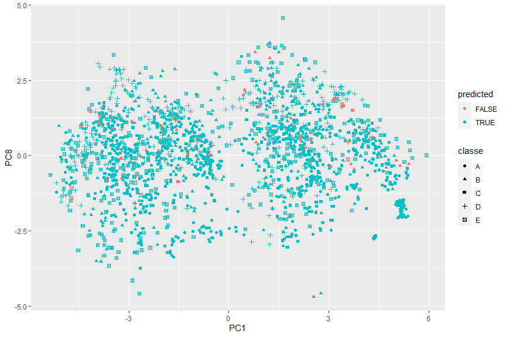

### Overview

The human activity recognition research has traditionally focused on discriminating between different activities, i.e. to predict "which" activity was performed at a specific point in time.

In this report, we explore the Weight Lifting Exercises dataset in which 6 young health participants were asked to perform one set of 10 repetitions of the Unilateral Dumbbell Biceps Curl in five different fashions: exactly according to the specification (Class A), throwing the elbows to the front (Class B), lifting the dumbbell only halfway (Class C), lowering the dumbbell only halfway (Class D) and throwing the hips to the front (Class E). Then we will attempt a few of training models to find the most accuracy method to predict the manner in which they did the exercise.

We will also use our prediction model to predict 20 specific test cases in the end.

### Data Cleaning


```r
library(data.table)
library(ggplot2)
library(dplyr)
library(caret)
set.seed(1204)
```


```r
null <- purrr::map(c('pml-training.csv', 'pml-testing.csv'), function(csvfile) {
    if (!file.exists(csvfile)) {
        url <- sprintf('https://d396qusza40orc.cloudfront.net/predmachlearn/%s', csvfile)
        download.file(url, destfile = csvfile, method = 'curl')
    }
})
pmlTraining <- fread('pml-training.csv')
pmlTesting <- fread('pml-testing.csv')
head(pmlTraining, 1)
```

```
##    V1 user_name raw_timestamp_part_1 raw_timestamp_part_2   cvtd_timestamp
## 1:  1  carlitos           1323084231               788290 05/12/2011 11:23
##    new_window num_window roll_belt pitch_belt yaw_belt total_accel_belt
## 1:         no         11      1.41       8.07    -94.4                3
##    kurtosis_roll_belt kurtosis_picth_belt kurtosis_yaw_belt skewness_roll_belt
## 1:                 NA                  NA                NA                 NA
##    skewness_roll_belt.1 skewness_yaw_belt max_roll_belt max_picth_belt
## 1:                   NA                NA            NA             NA
##    max_yaw_belt min_roll_belt min_pitch_belt min_yaw_belt amplitude_roll_belt
## 1:           NA            NA             NA           NA                  NA
##    amplitude_pitch_belt amplitude_yaw_belt var_total_accel_belt avg_roll_belt
## 1:                   NA                 NA                   NA            NA
##    stddev_roll_belt var_roll_belt avg_pitch_belt stddev_pitch_belt
## 1:               NA            NA             NA                NA
##    var_pitch_belt avg_yaw_belt stddev_yaw_belt var_yaw_belt gyros_belt_x
## 1:             NA           NA              NA           NA            0
##    gyros_belt_y gyros_belt_z accel_belt_x accel_belt_y accel_belt_z
## 1:            0        -0.02          -21            4           22
##    magnet_belt_x magnet_belt_y magnet_belt_z roll_arm pitch_arm yaw_arm
## 1:            -3           599          -313     -128      22.5    -161
##    total_accel_arm var_accel_arm avg_roll_arm stddev_roll_arm var_roll_arm
## 1:              34            NA           NA              NA           NA
##    avg_pitch_arm stddev_pitch_arm var_pitch_arm avg_yaw_arm stddev_yaw_arm
## 1:            NA               NA            NA          NA             NA
##    var_yaw_arm gyros_arm_x gyros_arm_y gyros_arm_z accel_arm_x accel_arm_y
## 1:          NA           0           0       -0.02        -288         109
##    accel_arm_z magnet_arm_x magnet_arm_y magnet_arm_z kurtosis_roll_arm
## 1:        -123         -368          337          516                NA
##    kurtosis_picth_arm kurtosis_yaw_arm skewness_roll_arm skewness_pitch_arm
## 1:                 NA               NA                NA                 NA
##    skewness_yaw_arm max_roll_arm max_picth_arm max_yaw_arm min_roll_arm
## 1:               NA           NA            NA          NA           NA
##    min_pitch_arm min_yaw_arm amplitude_roll_arm amplitude_pitch_arm
## 1:            NA          NA                 NA                  NA
##    amplitude_yaw_arm roll_dumbbell pitch_dumbbell yaw_dumbbell
## 1:                NA      13.05217        -70.494    -84.87394
##    kurtosis_roll_dumbbell kurtosis_picth_dumbbell kurtosis_yaw_dumbbell
## 1:                     NA                      NA                    NA
##    skewness_roll_dumbbell skewness_pitch_dumbbell skewness_yaw_dumbbell
## 1:                     NA                      NA                    NA
##    max_roll_dumbbell max_picth_dumbbell max_yaw_dumbbell min_roll_dumbbell
## 1:                NA                 NA               NA                NA
##    min_pitch_dumbbell min_yaw_dumbbell amplitude_roll_dumbbell
## 1:                 NA               NA                      NA
##    amplitude_pitch_dumbbell amplitude_yaw_dumbbell total_accel_dumbbell
## 1:                       NA                     NA                   37
##    var_accel_dumbbell avg_roll_dumbbell stddev_roll_dumbbell var_roll_dumbbell
## 1:                 NA                NA                   NA                NA
##    avg_pitch_dumbbell stddev_pitch_dumbbell var_pitch_dumbbell avg_yaw_dumbbell
## 1:                 NA                    NA                 NA               NA
##    stddev_yaw_dumbbell var_yaw_dumbbell gyros_dumbbell_x gyros_dumbbell_y
## 1:                  NA               NA                0            -0.02
##    gyros_dumbbell_z accel_dumbbell_x accel_dumbbell_y accel_dumbbell_z
## 1:                0             -234               47             -271
##    magnet_dumbbell_x magnet_dumbbell_y magnet_dumbbell_z roll_forearm
## 1:              -559               293               -65         28.4
##    pitch_forearm yaw_forearm kurtosis_roll_forearm kurtosis_picth_forearm
## 1:         -63.9        -153                    NA                     NA
##    kurtosis_yaw_forearm skewness_roll_forearm skewness_pitch_forearm
## 1:                   NA                    NA                     NA
##    skewness_yaw_forearm max_roll_forearm max_picth_forearm max_yaw_forearm
## 1:                   NA               NA                NA              NA
##    min_roll_forearm min_pitch_forearm min_yaw_forearm amplitude_roll_forearm
## 1:               NA                NA              NA                     NA
##    amplitude_pitch_forearm amplitude_yaw_forearm total_accel_forearm
## 1:                      NA                    NA                  36
##    var_accel_forearm avg_roll_forearm stddev_roll_forearm var_roll_forearm
## 1:                NA               NA                  NA               NA
##    avg_pitch_forearm stddev_pitch_forearm var_pitch_forearm avg_yaw_forearm
## 1:                NA                   NA                NA              NA
##    stddev_yaw_forearm var_yaw_forearm gyros_forearm_x gyros_forearm_y
## 1:                 NA              NA            0.03               0
##    gyros_forearm_z accel_forearm_x accel_forearm_y accel_forearm_z
## 1:           -0.02             192             203            -215
##    magnet_forearm_x magnet_forearm_y magnet_forearm_z classe
## 1:              -17              654              476      A
```

The training set consists of 19622 observations of 160 variables. We notice a lot of variables contain `NA` values so our strategy is to drop variables which have more than 95% of `NA` and remove all observations with `NA`. In the meantime, because the first 7 variables V1, user_name, raw_timestamp_part_1, raw_timestamp_part_2, cvtd_timestamp, new_window, num_window are not data from accelerometers, we drop them from training set as well. The values of `classe` would be kept in a seperate variable.


```r
classe <- factor(pmlTraining$classe)
pmlTraining <- pmlTraining %>%
    dplyr::select(which(sapply(pmlTraining, function(x) mean(is.na(x)) < 0.05))) %>%
    dplyr::select(-1:-7) %>%
    dplyr::select(-classe) %>%
    tidyr::drop_na()
```

We only have 52 variables left.

### Preprocessing with PCA

While the number of predictors is reduced significantly, we still try to optimize it once again by preprocessing the training set with PCA method. We set the threshold to 1 to preserve as much of the data's variation as possible. The testing set would apply the same PCA fitting with training set then.


```r
pcaThreshold <- 1
pcaPreprocess <- caret::preProcess(pmlTraining, method = 'pca', thresh = pcaThreshold)
pmlTraining <- predict(pcaPreprocess, pmlTraining)
pmlTesting <- predict(pcaPreprocess, pmlTesting) %>% dplyr::select(names(pmlTraining))
```

The number of variables is unchanged 52 but it's ok.

### Cross Validation and Out-of-Sample Error

In order to limit the effects of overfitting, we make a `trainControl` to define k-fold cross validation with 10 resampling iterations improve the efficicency of the models.

Our ultimate target is to predict correctly 20 specific test cases. So the expected out-of-sample error should be lower than 5%. In other word, the accuracy of our model must be higher than 95% or better. To minimize the in-sample error, original training set is splitted into 2 different parts with ratio 9:1.


```r
trControl <- caret::trainControl(method = 'cv', number = 10)
inTrain <- createDataPartition(classe, p = .9, list = FALSE)
training <- pmlTraining %>% slice(inTrain)
testing <- pmlTraining %>% slice(-inTrain)
```

We will train our dataset in 3 different algorithms to find the most effective model: `Decision Tree`, `Bagging` and `Random Forest`.

### Decision Tree Model


```r
rpartModel <- caret::train(x = training, y = classe[inTrain], method = 'rpart', trControl = trControl)
rpartModel
```

```
## CART 
## 
## 17662 samples
##    52 predictor
##     5 classes: 'A', 'B', 'C', 'D', 'E' 
## 
## No pre-processing
## Resampling: Cross-Validated (10 fold) 
## Summary of sample sizes: 15895, 15895, 15896, 15895, 15896, 15896, ... 
## Resampling results across tuning parameters:
## 
##   cp          Accuracy   Kappa    
##   0.02670095  0.3979766  0.2185472
##   0.04485759  0.3683609  0.1504545
##   0.05312500  0.3118549  0.0463352
## 
## Accuracy was used to select the optimal model using the largest value.
## The final value used for the model was cp = 0.02670095.
```

```r
confusionMatrix(classe[-inTrain], predict(rpartModel, testing))$overall
```

```
##       Accuracy          Kappa  AccuracyLower  AccuracyUpper   AccuracyNull 
##      0.3918367      0.2015480      0.3701457      0.4138520      0.5081633 
## AccuracyPValue  McnemarPValue 
##      1.0000000            NaN
```

The accuracy result 0.3979766 is too low and does not meet our expectation. The prediction error plot by 2 most important predictors is shown as below.


```r
predictionError <- function(modelFit, varImp = caret::varImp(modelFit)$importance) {
    topvars <- varImp %>% dplyr::arrange(desc(Overall)) %>% head(n = 2) %>% row.names()
    predicted <- (classe[-inTrain] == predict(modelFit, testing))
    rpartPredict <- testing %>%
        select(topvars) %>%
        mutate(classe = classe[-inTrain], predicted = predicted) %>%
        arrange(desc(predicted))
    ggplot(data = rpartPredict, size = 1) +
        geom_point(aes(x = rpartPredict[[1]], y = rpartPredict[[2]], colour = predicted, pch = classe)) +
        labs(x = topvars[1], y = topvars[2])
}
predictionError(rpartModel)
```

<!-- -->

### Tree Bagging Model


```r
treebagModel <- caret::train(x = training, y = classe[inTrain], method = 'treebag', trControl = trControl)
treebagModel
```

```
## Bagged CART 
## 
## 17662 samples
##    52 predictor
##     5 classes: 'A', 'B', 'C', 'D', 'E' 
## 
## No pre-processing
## Resampling: Cross-Validated (10 fold) 
## Summary of sample sizes: 15896, 15897, 15895, 15896, 15896, 15895, ... 
## Resampling results:
## 
##   Accuracy   Kappa    
##   0.9657449  0.9566547
```

```r
confusionMatrix(classe[-inTrain], predict(treebagModel, testing))$overall
```

```
##       Accuracy          Kappa  AccuracyLower  AccuracyUpper   AccuracyNull 
##      0.9668367      0.9580301      0.9579241      0.9743140      0.2897959 
## AccuracyPValue  McnemarPValue 
##      0.0000000            NaN
```

The prediction accuracy of RTree Bagging model 0.9657449 is too good and meet our expectation. The prediction error plot by 2 most important predictors is shown as below.


```r
predictionError(treebagModel)
```

<!-- -->

### Random Forest Model


```r
rfModel <- randomForest::randomForest(x = training, y = classe[inTrain], trControl = trControl)
rfModel
```

```
## 
## Call:
##  randomForest(x = training, y = classe[inTrain], trControl = trControl) 
##                Type of random forest: classification
##                      Number of trees: 500
## No. of variables tried at each split: 7
## 
##         OOB estimate of  error rate: 1.5%
## Confusion matrix:
##      A    B    C    D    E class.error
## A 5016    4    0    1    1 0.001194743
## B   56 3338   19    2    3 0.023405500
## C    3   34 3027   15    1 0.017207792
## D    4    1   98 2789    3 0.036614853
## E    0    3   13    4 3227 0.006159532
```

The OOB estimate of error rate is about 0.015004. We can also see the OOB error stabilizes around such value since the number of trees reaches 200 in the plot below.


```r
errorRate <- data.table(rfModel$err.rate) %>%
    mutate(id = 1:nrow(rfModel$err.rate)) %>%
    reshape2::melt(measure.vars = names(rfModel$err.rate[1,]))
ggplot(errorRate) + geom_smooth(aes(x = id, y = value, colour = variable), size = 1) +
    labs(x = 'Number of Trees', y = 'Error Rate')
```

<!-- -->


```r
confusionMatrix(classe[-inTrain], predict(rfModel, testing))$overall
```

```
##       Accuracy          Kappa  AccuracyLower  AccuracyUpper   AccuracyNull 
##      0.9816327      0.9767573      0.9746618      0.9871034      0.2877551 
## AccuracyPValue  McnemarPValue 
##      0.0000000            NaN
```

The OOB error leads to the accuracy result is about 0.984996. It's too good and meet our expectation. The prediction error plot by 2 most important predictors is shown as below.


```r
predictionError(rfModel, caret::varImp(rfModel))
```

<!-- -->

### Result

So now we have 2 models `Tree Bagging` and `Random Forest` that both give the prediction accuracy better than 96%.

Let's compare the prediction on the `pmlTesting` of 20 specific test cases made by them.


```r
treebagPredict <- predict(treebagModel, pmlTesting)
rfPredict <- predict(rfModel, pmlTesting)
confusionMatrix(treebagPredict, rfPredict)
```

```
## Confusion Matrix and Statistics
## 
##           Reference
## Prediction A B C D E
##          A 7 0 0 0 0
##          B 0 8 0 0 0
##          C 0 0 1 0 0
##          D 0 0 0 1 0
##          E 0 0 0 0 3
## 
## Overall Statistics
##                                      
##                Accuracy : 1          
##                  95% CI : (0.8316, 1)
##     No Information Rate : 0.4        
##     P-Value [Acc > NIR] : 1.1e-08    
##                                      
##                   Kappa : 1          
##                                      
##  Mcnemar's Test P-Value : NA         
## 
## Statistics by Class:
## 
##                      Class: A Class: B Class: C Class: D Class: E
## Sensitivity              1.00      1.0     1.00     1.00     1.00
## Specificity              1.00      1.0     1.00     1.00     1.00
## Pos Pred Value           1.00      1.0     1.00     1.00     1.00
## Neg Pred Value           1.00      1.0     1.00     1.00     1.00
## Prevalence               0.35      0.4     0.05     0.05     0.15
## Detection Rate           0.35      0.4     0.05     0.05     0.15
## Detection Prevalence     0.35      0.4     0.05     0.05     0.15
## Balanced Accuracy        1.00      1.0     1.00     1.00     1.00
```

Voila! They are completely matched with same prediction B, A, B, A, A, E, D, B, A, A, B, C, B, A, E, E, A, B, B, B.

### Appendix

Now imagine we don't care to get all predictions correct, but just 80% of them (80% or higher TO PASS). We could lower our accuracy expectation by setting a smaller PCA threshold, for example `0.4`.

Let's see how it works.


```r
pcaThreshold <- 0.4
newPreprocess <- caret::preProcess(pmlTraining, method = 'pca', thresh = pcaThreshold)
pmlTraining <- predict(newPreprocess, pmlTraining)
pmlTesting <- predict(newPreprocess, pmlTesting) %>% dplyr::select(names(pmlTraining))
training <- pmlTraining %>% slice(inTrain)
testing <- pmlTraining %>% slice(-inTrain)
newPreprocess
```

```
## Created from 19622 samples and 52 variables
## 
## Pre-processing:
##   - centered (52)
##   - ignored (0)
##   - principal component signal extraction (52)
##   - scaled (52)
## 
## PCA needed 3 components to capture 40 percent of the variance
```

```r
rfModel <- randomForest::randomForest(x = training, y = classe[inTrain], trControl = trControl)
rfModel
```

```
## 
## Call:
##  randomForest(x = training, y = classe[inTrain], trControl = trControl) 
##                Type of random forest: classification
##                      Number of trees: 500
## No. of variables tried at each split: 1
## 
##         OOB estimate of  error rate: 35.6%
## Confusion matrix:
##      A    B    C    D    E class.error
## A 3674  297  439  349  263   0.2684190
## B  432 1993  404  283  306   0.4169105
## C  418  355 1837  251  219   0.4035714
## D  303  242  242 1863  245   0.3564767
## E  351  336  261  292 2007   0.3818910
```

```r
rfPredict <- predict(rfModel, pmlTesting)
confusionMatrix(treebagPredict, rfPredict)
```

```
## Confusion Matrix and Statistics
## 
##           Reference
## Prediction A B C D E
##          A 6 0 1 0 0
##          B 0 6 1 1 0
##          C 0 0 0 1 0
##          D 0 0 0 1 0
##          E 0 0 0 0 3
## 
## Overall Statistics
##                                           
##                Accuracy : 0.8             
##                  95% CI : (0.5634, 0.9427)
##     No Information Rate : 0.3             
##     P-Value [Acc > NIR] : 5.55e-06        
##                                           
##                   Kappa : 0.7297          
##                                           
##  Mcnemar's Test P-Value : NA              
## 
## Statistics by Class:
## 
##                      Class: A Class: B Class: C Class: D Class: E
## Sensitivity            1.0000   1.0000   0.0000   0.3333     1.00
## Specificity            0.9286   0.8571   0.9444   1.0000     1.00
## Pos Pred Value         0.8571   0.7500   0.0000   1.0000     1.00
## Neg Pred Value         1.0000   1.0000   0.8947   0.8947     1.00
## Prevalence             0.3000   0.3000   0.1000   0.1500     0.15
## Detection Rate         0.3000   0.3000   0.0000   0.0500     0.15
## Detection Prevalence   0.3500   0.4000   0.0500   0.0500     0.15
## Balanced Accuracy      0.9643   0.9286   0.4722   0.6667     1.00
```

It only needs 3 components to capture 40 percent of the variance, instead of previous 52 components. It improves hugely the calculation performance. And though the new OOB error is just 0.3560186, it predicts incorrectly only 4 cases, enough to get 80% score TO PASS.
